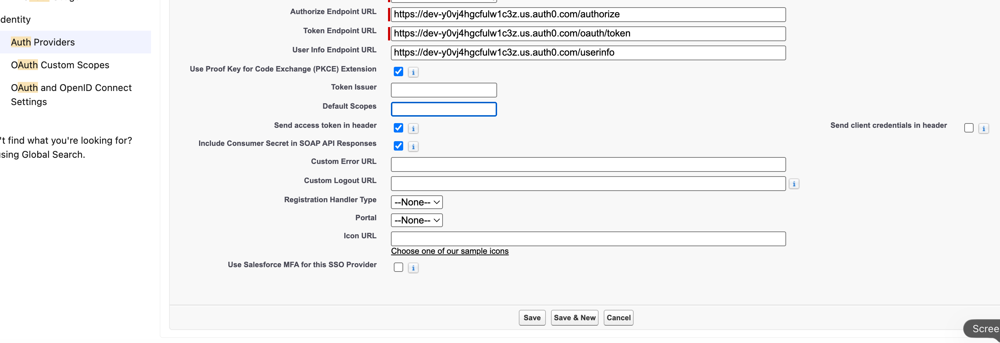
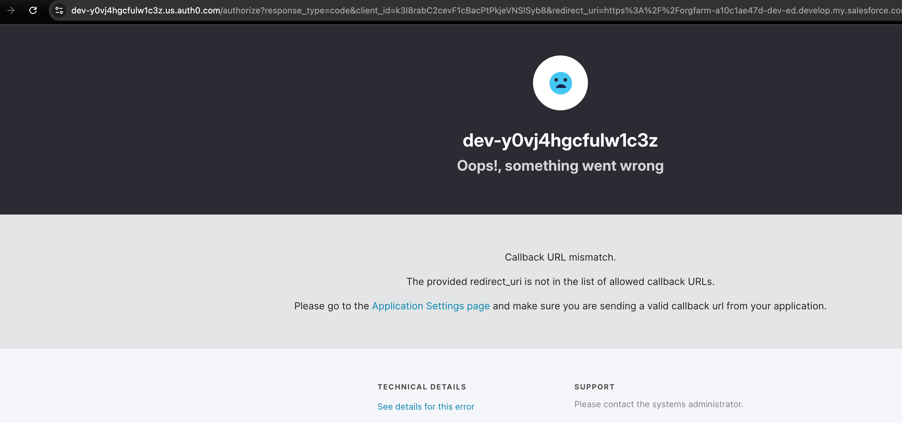
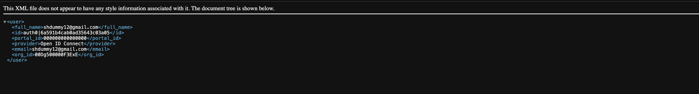

SimplifyIAM IAM Implementation Portfolio
Cohort: SimplifyIAM Live Cohort  Name: Sheroziy  LinkedIn: [LinkedIn URL] In progress — SimplifyIAM Live Cohort


What I Built
Over five live Saturday sessions I built a complete IAM environment from scratch using midPoint, OpenLDAP, and Auth0. The environment runs on a dedicated cloud server and replicates how IAM provisioning works in a real enterprise engagement.

This repository documents my configuration, screenshots, and decisions for each session. It is intended as portfolio evidence for IAM implementation roles.


Environment
Component
Purpose
midPoint
IGA platform - identity lifecycle, provisioning, reconciliation
SimplifyHR (Flask)
HR source of truth - simulates enterprise HRIS
OpenLDAP
Target directory - user accounts provisioned here
Auth0
Access management - OIDC and SAML federation


Session Deliverables
Saturday 1 - Architecture and Environment
Architecture diagram or description committed
Screenshot: midPoint Screens
Screenshot: SimplifyHR dashboard running
Screenshot: OpenLDAP screens and OU structure

What I built: [Fill in - 2 sentences max]

Resume bullet: [Your bullet here]


Saturday 2 - Joiner Workflow
HR source connector configuration (screenshot or XML snippet)
Correlation rule definition (screenshot or XML snippet)
Inbound mapping table (screenshot)
Screenshot: New Joiner account in OpenLDAP after reconciliation

What I built: [Fill in - 2 sentences max]

Resume bullet: [Your bullet here]


Saturday 3 - Mover and Leaver Workflows
Role definitions created (screenshot or XML snippet)
Mover workflow configuration (screenshot)
Screenshot: Robert Klein account disabled/deleted after leaver trigger
Reconciliation results (screenshot)

What I built: [Fill in - 2 sentences max]

Resume bullet: [Your bullet here]


Saturday 4 - Access Management
Auth0 OIDC application configuration (screenshot)
SAML integration SP and IdP config (screenshot)
SAML assertion screenshot (redact any sensitive values)
JWT claims screenshot

What I built: Configured Auth0 as the Identity Provider for Salesforce using OIDC, so a test user logs into Salesforce with their Auth0 identity. Then built granular consent management — separate consent switches stored in `app_metadata`, surfaced as custom JWT claims by a post-login Action, and verified that withdrawing consent updates the very next token.

```
E1: SSO flow
User → Salesforce (SP) → Auth0 (IdP) /authorize → Universal Login → token → back to Salesforce → logged in

E2: Consent flow
app_metadata (consent switches) → Post-Login Action → custom claims in ID token (JWT) → downstream systems obey
```

How I did it

E1 — Salesforce SSO via OIDC
- Created a free Salesforce Developer Edition org and a Connected App with OAuth scopes `openid profile email`
- Created an Auth0 Regular Web Application ("Salesforce Partner Portal")
- Configured an Auth Provider in Salesforce (type: OpenID Connect) pointing at my Auth0 tenant's `/authorize`, `/oauth/token`, and `/userinfo` endpoints
- Tested with the Test-Only Initialization URL → Auth0 Universal Login → redirected back into Salesforce as my test user

E2 — Granular Consent Management
- Stored per-category consent (`terms_accepted`, `marketing_emails`, `analytics_tracking`, `third_party_sharing`) in the test user's `app_metadata` (GDPR Article 7 requires consent to be specific, not one bundled checkbox)
- Wrote a Post-Login Action that blocks login if terms aren't accepted at the current version, and surfaces each consent category as its own JWT claim
- Built an authorize URL with `response_type=id_token` and `redirect_uri=https://jwt.io` to decode tokens
- Simulated consent withdrawal: flipped `analytics_tracking` to `false` in app_metadata → next login's token immediately showed `false`

What went wrong and how I fixed it

| Problem | Cause | Fix |
|---|---|---|
| "Callback URL mismatch" on first SSO test | The redirect URI Salesforce sent wasn't on Auth0's allowed list (my real org URL had `.develop.` in it) | Copied the exact Callback URL from Salesforce's Auth Provider page into Auth0's Allowed Callback URLs |
| "Oops, something went wrong" on the jwt.io authorize URL | Error details + Monitoring → Logs showed `invalid_request: Unknown client` — the client_id in my URL had a look-alike character typo | Copied the Client ID with Auth0's copy button instead of retyping it |
| Wasn't sure which credentials to use at Universal Login | Mixed up admin login vs. tenant users | Learned the separation: dashboard admin manages config; the test user (in User Management) is who logs in through the authorize URL |

Biggest takeaway from debugging: read the actual error. Auth0's "See details for this error" and Monitoring → Logs give the real reason — guessing at settings doesn't.

How federation connects to the IGA layer you built in Sessions 2 and 3:
In Weeks 2–3 I built the IGA side — midPoint provisioning governed accounts into the directory from an HR source. Federation is the layer on top: once an identity exists, OIDC lets that user log into an external app like Salesforce using their central identity. IGA answers "who exists and what may they have"; federation answers "how they prove who they are at login."

Screenshots


*Salesforce Auth Provider pointing at my Auth0 tenant's OIDC endpoints*


*The callback mismatch that taught me how Auth0's allowed-list protects redirects*


*Salesforce authcallback showing the authenticated Auth0 test user — provider "Open ID Connect" confirms the OIDC federation worked*

Resume bullet: Implemented B2B federation with Auth0 as OIDC Identity Provider for Salesforce, and built GDPR-aligned granular consent management using Auth0 Actions to surface per-category consent as custom JWT claims consumed by downstream systems.


Saturday 5 - Career Preparation
Final resume bullets section (5 bullets, one per session)
LinkedIn before and after headline
Mock interview reflection

Resume bullets (copy these to your CV):

[Saturday 1 bullet]
[Saturday 2 bullet]
[Saturday 3 bullet]
[Saturday 4 bullet]
[Saturday 5 bullet]


My Transformation
Where I started: [Role, experience level, what you could not explain or do before the cohort]

Where I am now: [What you built, what you can demo, what you can now explain in an interview]

Roles I am targeting: [Job titles, geography, companies if relevant]


